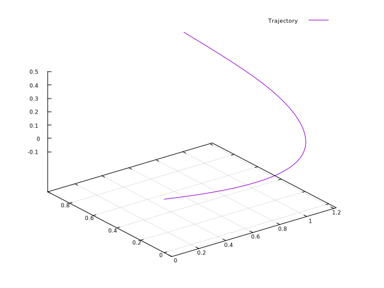
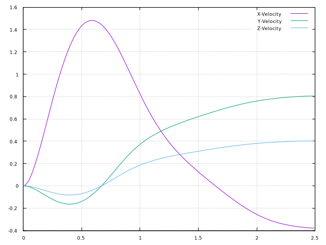
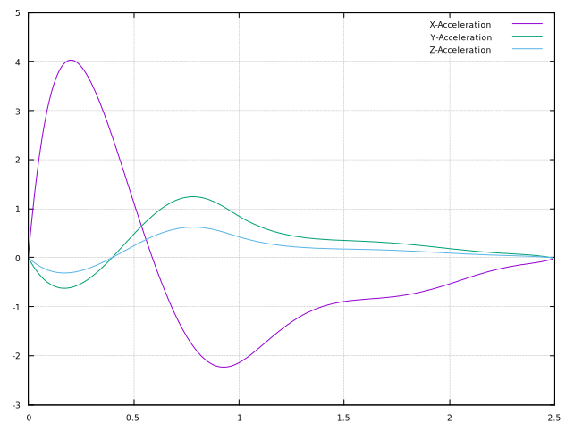

# Piecewise Polynomial Path Planner (P4)

## Description
Generalized piecewise polynomial solver. Given a set of waypoints and associated
arrival times, the solver will find a set of piece-wise polynomials that
smoothly fit through the points and maintain continuity up to a specified
derivative. 

At the core of the polynomial solver is a cost-minimization loop formulated by
as a quadratic programming problem and solved with
[OSQP](https://github.com/oxfordcontrol/osqp). The solver fits the polynomials
while minimizing the squared norm of a specified derivative and adhering to
specified, derivative-based path constraints. This approach follows the
minimum snap problem formulation and solution published by [Mellinger and
Kumar](https://ieeexplore.ieee.org/abstract/document/5980409). The theory behind
the polynomial solver can be found in the [doc/tex](doc/tex) directory. Make the
document by following the instructions below.

Examples are found in the [examples](examples/) directory. 

## Example Usage
```c++
#include <cstdlib>
#include <Eigen/Dense>

#include "polynomial_solver.h"
#include "polynomial_sampler.h"

using namespace p4;

int main(int argc, char** argv) {

  // Time in seconds
  const std::vector<double> times = {0, 1, 2.5};

  // NodeEqualityBound(dimension_idx, node_idx, derivative_idx, value)
  const std::vector<NodeEqualityBound> node_equality_bounds = {
    // Constraining position, velocity, and acceleration to zero
    NodeEqualityBound(0,0,0,0),
    NodeEqualityBound(1,0,0,0),
    NodeEqualityBound(2,0,0,0),
    NodeEqualityBound(0,0,1,0),
    NodeEqualityBound(1,0,1,0),
    NodeEqualityBound(2,0,1,0),
    NodeEqualityBound(0,0,2,0),
    NodeEqualityBound(1,0,2,0),
    NodeEqualityBound(2,0,2,0),

    // The second node is constraining position to (1,0,0)
    NodeEqualityBound(0,1,0,1),
    NodeEqualityBound(1,1,0,0),
    NodeEqualityBound(2,1,0,0),

    // The third node is contraining position to (1,1,free)
    NodeEqualityBound(0,2,0,1),
    NodeEqualityBound(1,2,0,1),
  };

  // NodeInequalityBound(dimension_idx, node_idx, derivative_idx, lower, upper)
  const std::vector<NodeInequalityBound> node_inequality_bounds = {
    // Constraining the z value of the third node above 0.5
    NodeInequalityBound(2,2,0,0.5,NodeInequalityBound::INFTY),
  };

  // SegmentInequalityBound(segment_idx, derivative_idx, mapping, value)
  // Segment inequality bounds constrain a derivative of a segment to 
  //   dot(mapping,dx^n/dt^n) < value
  const std::vector<SegmentInequalityBound> segment_inequality_bounds = {
    // Constraining the x-acceleration of the first segment below 4 m/s^2
    SegmentInequalityBound(0,2,Eigen::Vector3d(1,0,0),4),
  };

  // Configure solver options
  PolynomialSolver::Options solver_options;
  solver_options.num_dimensions   = 3;   // 3D
  solver_options.polynomial_order = 8;   // Fit an 8th-order polynomial
  solver_options.continuity_order = 4;   // Require continuity through the 4th derivative
  solver_options.derivative_order = 2;   // Minimize the 2nd derivative (acceleration)

  // Configure the OSQP settings
  // Reference: https://osqp.org/docs/interfaces/cc++#settings
  solver_options.osqp_settings.polish = true;       // Polish the solution, getting the best answer possible
  solver_options.osqp_settings.verbose = false;     // Suppress the printout

  // Solve
  PolynomialSolver solver(solver_options);
  const PolynomialPath path
    = solver.Run(
        times, 
        node_equality_bounds,
        node_inequality_bounds,
        segment_inequality_bounds);

  // Sample the acceleration profile
  PolynomialSampler::Options sampler_options;
  sampler_options.frequency        = 100;
  sampler_options.derivative_order = 2;

  PolynomialSampler sampler(sampler_options);
  Eigen::MatrixXd samples = sampler.Run(times, path);
```

 
 



## Build Requirements
1) Install [Eigen](http://eigen.tuxfamily.org)
2) Install [OSQP](https://github.com/oxfordcontrol/osqp)
3) [Optional GUI] Install gnuplot and boost
```bash
sudo apt install libboost-all-dev gnuplot
```

If the installation instructions from OSQP's website are not working properly, follow the guidelines below:
```
git clone https://github.com/oxfordcontrol/osqp
cd osqp
git submodule update --init --recursive
mkdir build
cd build
```

In Linux and Mac OS run
```
     cmake -G "Unix Makefiles" ..
```
In Windows run
```
     cmake -G "MinGW Makefiles" ..
```
```
cmake --build .
```


## Build without GUI
```bash
mkdir build && cd build
cmake -DBUILD_3D_EXAMPLE=false ..
make -j4
```

## Build with GUI example 
```bash
mkdir build && cd build
cmake ..
make -j4
```


## Run
```bash
cd build/examples
./${EXECUTABLE_OF_CHOICE}
```

## Linking
Builds a shared library called lib_p4.

## Docker
For a quick build and test, consider using the included docker file. It's not
set up to attach to a display, so the 3D example is not built by default. Build
and run the docker image and speed executable:
```
docker build --tag=p4 . && docker run -it p4
--> ./speed
```

## Documentation
The theoretical documentation is written in LaTex. Latex must be installed
before building the pdf.

```bash
cd doc/tex
make
# open main.pdf
```

## Credits
- [OSQP](https://github.com/oxfordcontrol/osqp)
- [Eigen](http://eigen.tuxfamily.org)
- [gnuplot](http://www.gnuplot.info)
- [gnuplot-iostream](http://stahlke.org/dan/gnuplot-iostream/)

## Contact
Tucker Haydon (tuckerhaydon@gmail.com)

